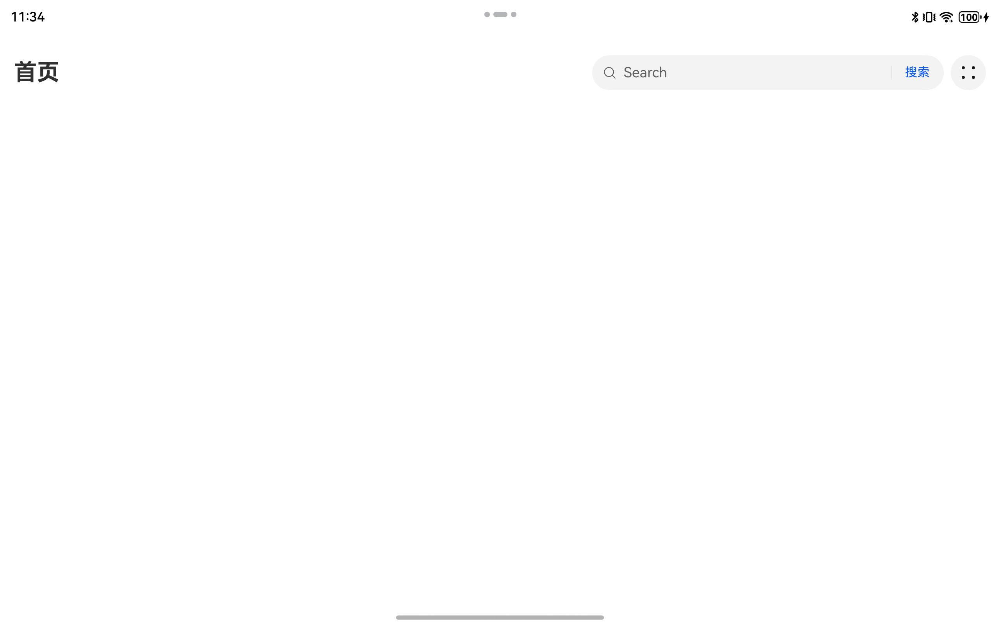
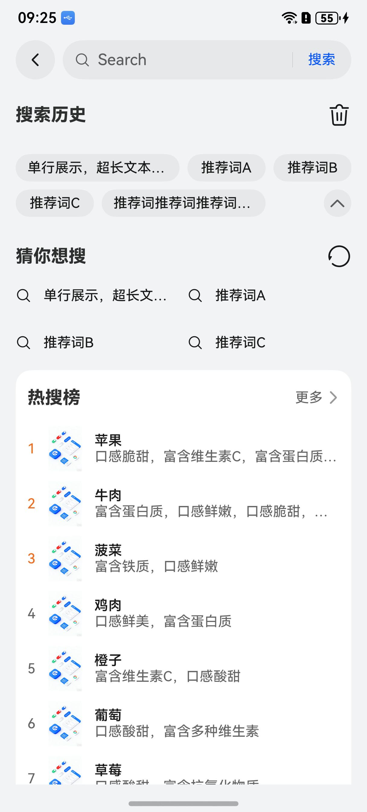
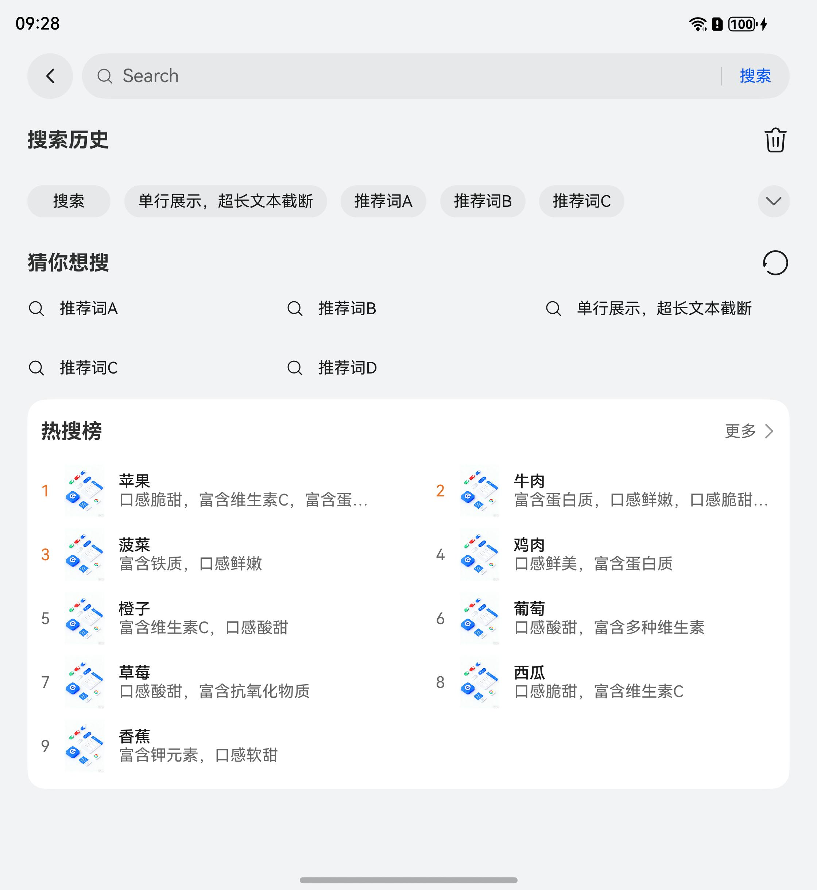
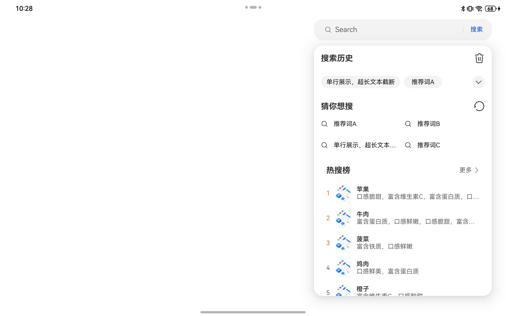
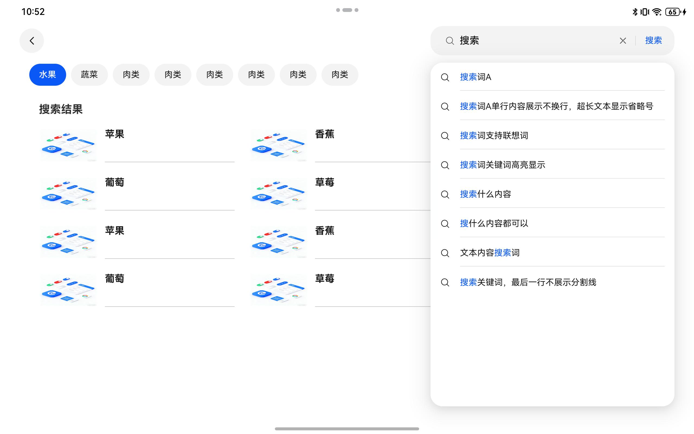
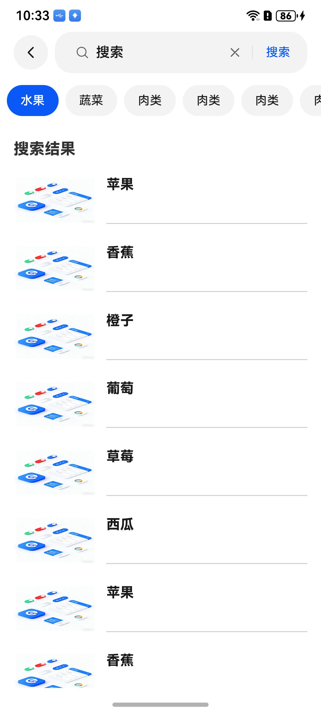
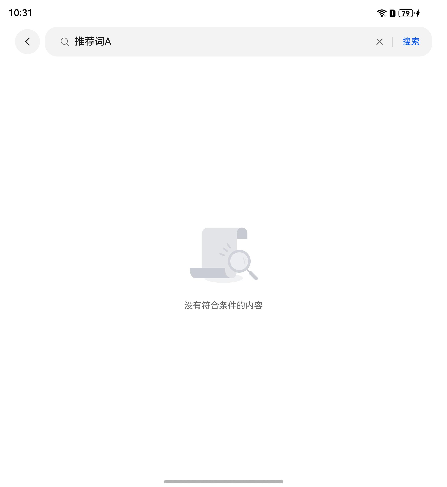
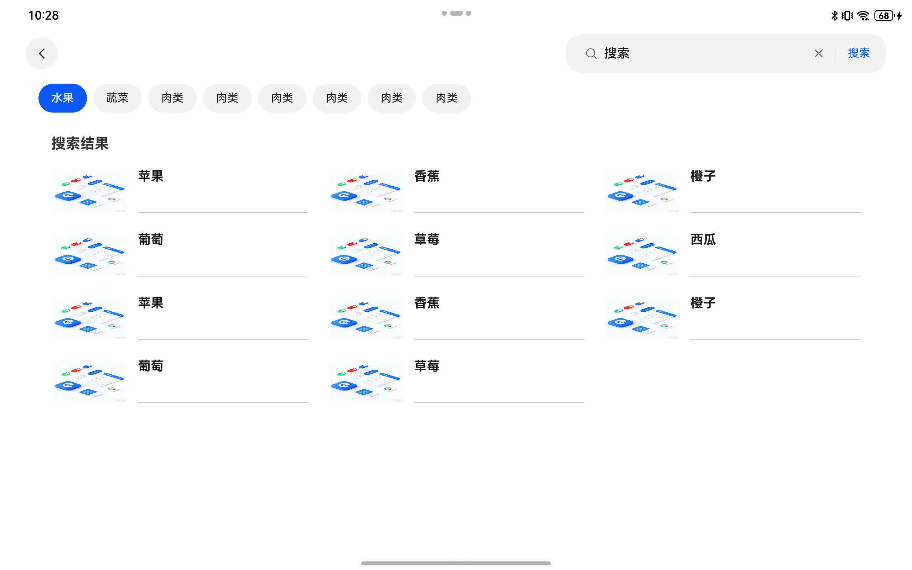

# 搜索组件一多适配用例设计汇报

## 1. 一多适配情况

本次用例设计围绕搜索场景的一多适配评测任务展开，用例不是只验证“有没有写断点代码”，而是验证用户能观察到的一多适配效果：不同设备形态下，入口、列表、间距、历史胶囊、浅层窗口、搜索栏交互和横竖屏切换是否符合预期。

### 一多适配效果

<div style='overflow-x:auto'>
  <table style='min-width:800px'>
    <tr>
      <th></th>
      <th>直板机</th>
      <th>折叠屏</th>
      <th>平板（浅层窗口）</th>
    </tr>
    <tr>
      <th scope='row'>搜索入口</th>
      <td valign='top'></td>
      <td valign='top'></td>
      <td valign='top'></td>
    </tr>
    <tr>
      <th scope='row'>搜索首页</th>
      <td valign='top'></td>
      <td valign='top'></td>
      <td valign='top'></td>
    </tr>
    <tr>
      <th scope='row'>搜索联想</th>
      <td valign='top'></td>
      <td valign='top'></td>
      <td valign='top'></td>
    </tr>
    <tr>
      <th scope='row'>搜索结果</th>
      <td valign='top'></td>
      <td valign='top'></td>
      <td valign='top'></td>
    </tr>
  </table>
</div>

### AI Prompt

```
请将搜索工程做 HarmonyOS 一多适配，适配目标为直板机、折叠屏展开态、平板。要求同一套搜索业务逻辑在不同断点下有不同展示效果。

1. 搜索入口展示形态
直板机或 sm 断点下，搜索入口页保持手机效果，显示圆形搜索图标，点击后进入完整搜索页。
md/lg/xl 断点下，搜索入口页切换为完整搜索框入口，更符合大屏操作习惯。

2. 列表列数适配
- 搜索框和返回按钮始终占满屏幕宽度。
- 猜你想搜：sm 为 2 列，md/lg/xl 可提升到 3 列。
- 热搜榜：sm 为单列，md 变为 2 列，lg/xl 变为 3 列。
- 搜索结果：sm 为单列，md 变为 2 列，lg/xl 变为 3 列，列表间距在大屏下加大，避免内容过密。
- 页面左右边距：sm 16vp，md 24vp，lg/xl 32vp。
- 列表列间距、模块间距也需要相应增大，避免大屏内容过窄或过挤。

3. 历史胶囊适配
搜索历史使用栅格布局，历史胶囊词之间的间距根据屏幕宽度调整sm 8vp，md/lg/xl 12vp，胶囊词宽度最大不超过两栅格+一个Gutter，最小不低于一栅格。

4. 浅层窗口适配
浅层窗口是可开启能力。
未开启浅层窗口时，搜索流程与直板机一致：点击搜索入口进入完整搜索页，但页面内部仍要按断点完成列数和间距适配。
开启浅层窗口时，浅层窗口仅在lg/xl 断点下生效，此时搜索框宽度固定位400vp，点击搜索框不直接跳转完整搜索页，而是在当前页面搜索框下以 bindPopup 弹窗形式弹出浅层搜索窗口。弹窗宽度固定为 400vp，内容在弹窗内滚动。搜索框获焦时自动弹出弹窗，点击空白区域时关闭弹窗。提交搜索跳转到搜索结果页，结果页中搜索框固定在页面右上角，宽度400vp，获焦时也会弹出联想/首页弹窗。
浅层窗口内展示搜索输入、历史搜索、猜你喜欢、热门搜索、联想词、加载状态和搜索结果预览。窗口内布局与直板机一致。

5. 平板横竖屏切换
平板横屏处于 lg/xl 断点且浅层窗口已开启时，可以展示浅层搜索窗口。
当平板从入口页横竖屏切换，页面正常切换到不同形态的入口页。
从搜索首页横屏切换到竖屏，窗口进入 md 断点时，需要关闭浅层窗口，回到竖屏下的搜索入口页；从搜索首页竖屏切到横屏，回到横屏未打开浅层窗口的搜索入口页。
从搜索结果页横竖屏切换，与正常结果页页面相互切换。
```

## 2. 用例判定模型

### PassToPass

`PassToPass` 用例用于保护基础搜索能力。

其中单独设计一组“全设备 PassToPass”用例：不管当前设备是直板机、折叠屏展开态还是平板，都必须通过。这组用例只验证搜索业务的基本可用性和页面可操作性，不验证某个大屏适配效果是否生效。

典型覆盖：

- 应用可以正常启动。
- 搜索入口可见。
- 点击搜索入口可以进入完整搜索页。
- 输入关键词后可以展示联想词或结果。
- 返回按钮、搜索栏等基础交互不被截断、不越界。
- 直板机 `sm` 断点下保持手机样式。

### FailToPass

`FailToPass` 用例用于检测一多适配能力。

典型覆盖：

- 大屏入口从搜索图标变成完整搜索框。
- 列表在 `md/lg/xl` 断点下提升列数。
- 页面边距、列表间距、胶囊间距随断点增大。
- 平板横屏启用浅层窗口。
- 平板横屏切竖屏时关闭浅层窗口，回到完整页面逻辑。

## 3. 参考已有用例构造

思路：先获取窗口宽度并换算断点，再通过组件 bounds、可见性、宽度比例、列间距、是否存在弹窗等信息做自动化断言。

## 4. 设备与断点矩阵

| 设备形态 | 典型断点 | 用例定位 |
|---|---|---|
| 直板机 | `sm` | 主要跑 `PassToPass` 和 `CommonPassToPass`，证明基础搜索流程和手机样式不退化  |
| 折叠屏展开态 | `md` | 主要跑入口形态、列表列数、间距、历史胶囊的 `FailToPass` 和 `CommonPassToPass` |
| 平板 | `md/lg/xl` | 主要跑浅层窗口、结果页右上角搜索框、横竖屏切换的 `FailToPass` 和 `CommonPassToPass` |

## 5. 按一多适配点设计用例

### 5.0 全设备基础 PassToPass

这一组用例不绑定某个一多适配点，而是作为所有设备都必须满足的基础保护网。它的目标是避免 AI 在做一多适配时破坏原有搜索业务。

| 设备/断点 | 用例类型 | SearchBase 预期 | SearchAnswer/AI 预期 | 自动化验证点 |
|---|---|---|---|---|
| `sm/md/lg/xl` | PassToPass | 通过 | 通过 | 应用启动成功，搜索入口页可见 |
| `sm/md/lg/xl` | PassToPass | 通过 | 通过 | 搜索入口页存在可点击的搜索入口，不要求入口形态一致 |
| `sm/md/lg/xl` | PassToPass | 通过 | 通过 | 点击搜索入口后，可以进入完整搜索页或触发当前设备应有的搜索承载形态 |
| `sm/md/lg/xl` | PassToPass | 通过 | 通过 | 历史词胶囊正常换行、无遮挡、无越界 |
| `sm/md/lg/xl` | PassToPass | 通过 | 通过 | 输入关键词后能展示联想词，搜索联想始终为单列，不随断点扩列 |
| `sm/md/lg/xl` | PassToPass | 通过 | 通过 | 提交搜索后页面不白屏、不崩溃，搜索结果区域可见 |
| `sm/md/lg/xl` | PassToPass | 通过 | 通过 | 搜索栏返回按钮完整可见，关键组件不越界、不重叠 |

这组用例的断言不能写成“必须是搜索图标”或“必须是搜索框”，否则会把大屏正确适配误判为失败。它只验证基础流程可用，具体展示差异交给后面的 `FailToPass` 用例判断。

对应测试代码表：

| 用例文件 | 设备/断点 | 类型 | it 用例名称 |
|---|---|---|---|
| `all_device_pass_to_pass.test.ets` | `sm/md/lg/xl` | PassToPass | `should_start_ability_successfully`、`should_show_search_entry_visible`、`should_open_search_flow_from_entry`、`should_show_history_chips_without_overlap`、`should_show_suggestions_after_keyword_input`、`should_show_result_after_submit`、`should_keep_key_components_inside_window`、`should_keep_no_horizontal_overflow` |

### 5.1 搜索入口展示形态

| 设备/断点 | 用例类型 | SearchBase 预期 | SearchAnswer/AI 预期 | 自动化验证点 |
|---|---|---|---|---|
| ~~直板机 `sm`~~ | ~~PassToPass~~ | ~~通过~~ | ~~通过~~ | ~~搜索入口页显示圆形搜索图标；点击后进入完整搜索页~~ |
| 折叠屏展开 `md/lg` | FailToPass | 失败 | 通过 | 搜索入口页显示完整搜索框 |
| 平板横屏 `lg/xl` | FailToPass | 失败 | 通过 | 搜索入口页显示完整搜索框，不再保持手机入口 |

入口形态是用户进入搜索流程时最先看到的差异，也是判断一多适配是否生效的第一层用例。

对应测试代码表：

| 用例文件 | 设备/断点 | 类型 | it 用例名称 |
|---|---|---|---|
| `foldable_md_lg_fail_to_pass.test.ets` | 折叠屏展开 `md/lg` | FailToPass | `should_show_search_box_on_md_lg`、`should_enter_search_from_box_on_md_lg` |
| `tablet_lg_xl_fail_to_pass.test.ets` | 平板横屏 `lg/xl` | FailToPass | `should_show_search_box_on_lg_xl`、`should_not_keep_phone_icon_on_lg_xl` |

### 5.2 列表列数适配

| 设备/断点 | 用例类型 | SearchBase 预期 | SearchAnswer/AI 预期 | 自动化验证点 |
|---|---|---|---|---|
| `sm/md/lg/xl` | PassToPass | 通过 | 通过 | 搜索框和返回按钮始终占满屏幕宽度 |
| `sm` | PassToPass | 通过 | 通过 | 猜你想搜为 2 列，热搜榜为单列 |
| `md` | FailToPass | 失败 | 通过 | 猜你想搜提升到 3 列，热搜榜提升为 2 列 |
| `lg/xl` | FailToPass | 失败 | 通过 | 猜你想搜保持 3 列，热搜榜提升为 3 列 |
| 搜索结果页 `md` | FailToPass | 失败 | 通过 | 搜索结果从单列提升为 2 列 |
| 搜索结果页 `lg/xl` | FailToPass | 失败 | 通过 | 搜索结果从单列提升为 3 列 |

自动化断言：

- 统计同一行内 item 数量，判断列数。
- 对比 item 宽度和容器宽度，判断是否从单列变为多列。
- 在 `sm` 下保护手机列数，避免 AI 为了大屏适配误改直板机效果。
- 搜索联想单独断言为 1 列，避免被普通列表扩列规则误影响。
- 搜索结果页单独进入结果状态后断言列数，避免与搜索首页的猜你喜欢、热搜榜混在一起。

对应测试代码表：

| 用例文件 | 设备/断点 | 类型 | it 用例名称 |
|---|---|---|---|
| `autocomplete_all_device_pass_to_pass.test.ets` | `sm/md/lg/xl` | PassToPass | `should_keep_autocomplete_one_column_on_sm`、`should_keep_autocomplete_one_column_on_md`、`should_keep_autocomplete_one_column_on_lg_xl` |
| `phone_sm_pass_to_pass.test.ets` | 直板机 `sm` | PassToPass | `should_keep_guess_like_two_columns_on_sm`、`should_keep_hot_search_one_column_on_sm` |
| `guess_hot_md_fail_to_pass.test.ets` | `md` | FailToPass | `should_show_guess_like_three_columns_on_md`、`should_show_hot_search_two_columns_on_md` |
| `guess_hot_lg_xl_fail_to_pass.test.ets` | `lg/xl` | FailToPass | `should_show_guess_like_three_columns_on_lg_xl`、`should_show_hot_search_three_columns_on_lg_xl` |
| `search_result_fail_to_pass.test.ets` | 搜索结果页 `md/lg/xl` | FailToPass | `should_show_result_two_columns_on_md`、`should_show_result_three_columns_on_lg_xl` |

### 5.3 间距适配

| 设备/断点 | 用例类型 | SearchBase 预期 | SearchAnswer/AI 预期 | 自动化验证点 |
|---|---|---|---|---|
| `sm` | PassToPass | 通过 | 通过 | 页面左右边距为 16vp |
| `md` | FailToPass | 失败 | 通过 | 页面左右边距增大到 24vp |
| `lg/xl` | FailToPass | 失败 | 通过 | 页面左右边距增大到 32vp |
| `md/lg/xl` | FailToPass | 失败 | 通过 | 搜索结果项之间的纵向间距、模块间距变大 |

自动化断言建议：

- 获取页面根容器与首个内容组件的 bounds，计算左右边距。
- 获取相邻列表 item 的 bounds，计算行间距或列间距。
- `sm` 用例验证边距仍为 16vp；`md/lg/xl` 用例验证边距随断点增大。

对应测试代码表：

| 用例文件 | 设备/断点 | 类型 | it 用例名称 |
|---|---|---|---|
| `phone_sm_pass_to_pass.test.ets` | 直板机 `sm` | PassToPass | `should_keep_page_margin_16vp_on_sm`、`should_keep_result_gap_compact_on_sm` |
| `tablet_md_fail_to_pass.test.ets` | `md` | FailToPass | `should_set_page_margin_24vp_on_md`、`should_increase_module_gap_on_md` |
| `tablet_lg_xl_fail_to_pass.test.ets` | `lg/xl` | FailToPass | `should_set_page_margin_32vp_on_lg_xl`、`should_increase_result_gap_on_lg_xl` |

### 5.4 历史胶囊适配

| 设备/断点 | 用例类型 | SearchBase 预期 | SearchAnswer/AI 预期 | 自动化验证点 |
|---|---|---|---|---|
| `md/lg/xl` | FailToPass | 失败 | 通过 | 历史词使用栅格布局约束 |
| `md/lg/xl` | FailToPass | 失败 | 通过 | 胶囊最小宽度不低于一栅格 |
| `md/lg/xl` | FailToPass | 失败 | 通过 | 胶囊最大宽度不超过两栅格加一个 gutter |
| `md/lg/xl` | FailToPass | 失败 | 通过 | 胶囊之间的间距随屏幕变大而增大 |

自动化断言建议：

- 获取历史胶囊 bounds，验证宽度上下限。
- 验证相邻胶囊不重叠、不越界。
- 对比 `sm` 与 `md/lg/xl` 的胶囊间距，确认大屏间距增大。

对应测试代码表：

| 用例文件 | 设备/断点 | 类型 | it 用例名称 |
|---|---|---|---|
| `md_lg_xl_fail_to_pass.test.ets` | `md/lg/xl` | FailToPass | `should_use_grid_layout_for_history_chips_on_large_screen`、`should_keep_history_chip_min_width_at_least_one_grid_on_large_screen`、`should_keep_history_chip_max_width_within_two_grids_plus_gutter_on_large_screen`、`should_increase_history_chip_gap_on_large_screen` |

### 5.5 浅层窗口开启：首页搜索

| 设备/断点 | 用例类型 | SearchBase 预期 | SearchAnswer/AI 预期 | 自动化验证点 |
|---|---|---|---|---|
| `sm/md` | PassToPass | 通过 | 通过 | 仍然走完整搜索页，不弹浅层窗口 |
| 平板横屏 `lg/xl` | FailToPass | 失败 | 通过 | 点击搜索框不跳页，而是在当前页弹出浅层窗口 |
| 平板横屏 `lg/xl` | FailToPass | 失败 | 通过 | 弹窗宽度为 400vp |
| 平板横屏 `lg/xl` | FailToPass | 失败 | 通过 | 弹窗内展示输入框、历史、猜你喜欢、热搜、联想词、加载态、结果预览 |
| 平板横屏 `lg/xl` | FailToPass | 失败 | 通过 | 弹窗内容可以在窗口内滚动 |
| 平板横屏 `lg/xl` | FailToPass | 失败 | 通过 | 搜索框获焦自动弹窗 |
| 平板横屏 `lg/xl` | FailToPass | 失败 | 通过 | 点击空白区域后弹窗关闭 |
| 平板横屏 `lg/xl` | FailToPass | 失败 | 通过 | 弹窗提交搜索后关闭弹窗，并展示结果预览或结果页状态 |

自动化断言建议：

- 点击首页搜索框后，检查浅层窗口根节点是否出现。
- 校验弹窗 bounds 宽度接近 400vp。
- 校验弹窗 bounds 在窗口范围内。
- 提交搜索后检查弹窗消失，且搜索结果状态更新。

对应测试代码表：

| 用例文件 | 设备/断点 | 类型 | it 用例名称 |
|---|---|---|---|
| `phone_sm_md_pass_to_pass.test.ets` | `sm/md` | PassToPass | `should_not_open_home_popup_on_sm_md`、`should_enter_full_search_page_on_sm_md` |
| `tablet_lg_xl_fail_to_pass.test.ets` | 平板横屏 `lg/xl` | FailToPass | `should_open_home_popup_when_search_box_focused_on_lg_xl`、`should_keep_home_popup_width_400vp_on_lg_xl`、`should_show_home_popup_core_content_on_lg_xl`、`should_keep_home_popup_content_scrollable_on_lg_xl`、`should_close_home_popup_after_blank_click_on_lg_xl`、`should_close_home_popup_after_submit_on_lg_xl` |

### 5.6 浅层窗口开启：结果页搜索栏

| 设备/断点 | 用例类型 | SearchBase 预期 | SearchAnswer/AI 预期 | 自动化验证点 |
|---|---|---|---|---|
| `sm/md` | PassToPass | 通过 | 通过 | 结果页搜索栏按手机完整页逻辑展示，不弹浅层窗口 |
| 平板横屏 `lg/xl` | FailToPass | 失败 | 通过 | 结果页搜索框固定在页面右上角 |
| 平板横屏 `lg/xl` | FailToPass | 失败 | 通过 | 结果页搜索框宽度为 400vp |
| 平板横屏 `lg/xl` | FailToPass | 失败 | 通过 | 搜索框未聚焦、搜索弹框未出现时，搜索结果页按 3 列展示 |
| 平板横屏 `lg/xl` | FailToPass | 失败 | 通过 | 搜索框获焦后弹出联想/首页浅层窗口 |

自动化断言建议：

- 进入结果页后获取搜索框 bounds。
- 验证搜索框靠近页面右侧区域，且宽度约为 400vp。
- 在搜索框未聚焦时，统计搜索结果 item 同行数量，确认 `lg/xl` 下为 3 列。
- 聚焦结果页搜索框后，验证浅层窗口出现。

对应测试代码表：

| 用例文件 | 设备/断点 | 类型 | it 用例名称 |
|---|---|---|---|
| `phone_sm_md_pass_to_pass.test.ets` | `sm/md` | PassToPass | `should_keep_result_page_full_flow_on_sm_md`、`should_not_open_result_popup_on_sm_md` |
| `tablet_lg_xl_fail_to_pass.test.ets` | 平板横屏 `lg/xl` | FailToPass | `should_place_result_search_bar_at_top_right_on_lg_xl`、`should_keep_result_search_bar_width_400vp_on_lg_xl`、`should_show_result_three_columns_before_popup_on_lg_xl`、`should_open_result_popup_when_search_bar_focused_on_lg_xl` |

### 5.7 平板横竖屏切换

| 设备/断点 | 用例类型 | SearchBase 预期 | SearchAnswer/AI 预期 | 自动化验证点 |
|---|---|---|---|---|
| 搜索入口页`lg/xl` 横屏切到 `md` 竖屏 | FailToPass | 失败 | 通过 | 搜索入口页搜索框变为搜索圆形图标 |
| 搜索首页`lg/xl` 横屏切到 `md` 竖屏 | FailToPass | 失败 | 通过 | 搜索首页已打开的浅层窗口关闭，回到搜索入口页 |
| 搜索首页`md` 竖屏切到`lg/xl` 横屏 | FailToPass | 失败 | 通过 | 回到横屏未打开浅层窗口的搜索入口页 |
| 结果页 `lg/xl` 切到 `md` | FailToPass | 失败 | 通过 | 结果页不保留浅层窗口状态，恢复普通结果页展示 |
| 结果页`md` 竖屏切回 `lg/xl` 横屏 | FailToPass | 失败 | 通过 | 再次聚焦搜索框时可重新触发浅层窗口 |

自动化断言：

- 横屏先打开浅层窗口，确认弹窗存在。
- 旋转到竖屏或窗口进入 `md` 断点后，确认弹窗不存在。
- 确认页面仍停留在可操作的完整搜索页或结果页。
- 切回横屏后，再次聚焦搜索框，确认浅层窗口能力可重新触发。

对应测试代码表：

| 用例文件 | 设备/断点 | 类型 | it 用例名称 |
|---|---|---|---|
| `entry_page_rotation_fail_to_pass.test.ets` | 入口页 `lg/xl` 横屏切 `md` 竖屏 | FailToPass | `should_change_entry_search_box_to_icon_after_portrait_rotation` |
| `search_home_rotation_fail_to_pass.test.ets` | 搜索首页横竖屏切换 | FailToPass | `should_close_home_popup_after_portrait_rotation`、`should_return_to_entry_page_after_portrait_rotation`、`should_return_to_landscape_entry_without_popup_after_landscape_rotation` |
| `result_page_rotation_fail_to_pass.test.ets` | 结果页横竖屏切换 | FailToPass | `should_close_result_popup_after_portrait_rotation`、`should_recover_result_page_layout_after_portrait_rotation`、`should_reopen_result_popup_after_landscape_focus` |

## 6. 测试代码结构设计

第 6 节按第 5 节的适配点一一落到测试代码结构：`00` 对应全设备基础能力，`01` 到 `07` 分别对应入口、列表列数、间距、历史胶囊、浅层窗口首页、浅层窗口结果页、横竖屏切换。用例名称沿用现有工程风格，统一使用 `should_...` snake_case。

推荐结构如下：

```text
entry/src/ohosTest/ets/test/
├── List.test.ets
├── common/
│   ├── TestHelper.ets
│   ├── DeviceHelper.ets
│   ├── SearchActionHelper.ets
│   └── LayoutAssertHelper.ets
├── 00_common_pass_to_pass/
│   └── all_device_pass_to_pass.test.ets
├── 01_entry_shape/
│   ├── foldable_md_lg_fail_to_pass.test.ets
│   └── tablet_lg_xl_fail_to_pass.test.ets
├── 02_list_columns/
│   ├── autocomplete_all_device_pass_to_pass.test.ets
│   ├── phone_sm_pass_to_pass.test.ets
│   ├── guess_hot_md_fail_to_pass.test.ets
│   ├── guess_hot_lg_xl_fail_to_pass.test.ets
│   └── search_result_fail_to_pass.test.ets
├── 03_spacing/
│   ├── phone_sm_pass_to_pass.test.ets
│   ├── tablet_md_fail_to_pass.test.ets
│   └── tablet_lg_xl_fail_to_pass.test.ets
├── 04_history_capsule/
│   └── md_lg_xl_fail_to_pass.test.ets
├── 05_shallow_home/
│   ├── phone_sm_md_pass_to_pass.test.ets
│   └── tablet_lg_xl_fail_to_pass.test.ets
├── 06_shallow_result/
│   ├── phone_sm_md_pass_to_pass.test.ets
│   └── tablet_lg_xl_fail_to_pass.test.ets
└── 07_rotation/
    ├── entry_page_rotation_fail_to_pass.test.ets
    ├── search_home_rotation_fail_to_pass.test.ets
    └── result_page_rotation_fail_to_pass.test.ets
```

`List.test.ets` 只负责统一注册各业务点用例。失败文件夹就是失败适配点，失败用例名就是失败现象。

**公共工具层**

| 文件 | 作用 | 关键方法 |
|---|---|---|
| `TestHelper.ets` | 启动应用、查找组件、封装基础断言 | `startAbility()`、`findComponent()`、`expectVisible()`、`expectNotVisible()` |
| `DeviceHelper.ets` | 获取窗口宽度、断点、旋转状态 | `getWindowVpWidth()`、`getBreakpointName()`、`rotateToLandscape()`、`rotateToPortrait()` |
| `SearchActionHelper.ets` | 封装搜索业务动作 | `tapHomeSearchEntry()`、`inputKeyword()`、`submitSearch()`、`goToResultPage()`、`focusResultSearchBar()` |
| `LayoutAssertHelper.ets` | 封装布局断言 | `expectColumnCount()`、`expectHorizontalMargin()`、`expectGapGreaterThan()`、`expectWidthNear()`、`expectNoOverlap()`、`expectInWindow()` |

公共工具层只放动作和断言能力，不承载具体适配点判断。

## 7. 可观测性要求

为了让用例稳定，需要给关键组件提供可定位的测试标识。至少覆盖：

- 首页搜索图标。
- 首页完整搜索框。
- 搜索页根容器。
- 结果页根容器。
- 搜索栏返回按钮。
- 搜索输入框。
- 历史胶囊 item。
- 猜你想搜 item。
- 热搜榜 item。
- 搜索结果 item。
- 浅层窗口根容器。
- 结果页右上角搜索框。

这些标识不是业务实现要求，而是测试工程的可观测性要求。没有稳定锚点时，测试只能依赖文本或层级查找，后续 UI 文案和结构变化会让用例变脆。


> 这套用例不是验证 AI 是否写了某段代码，而是验证 AI 是否把搜索业务在多设备上的用户可见体验补齐，并且没有破坏直板机基础体验。
